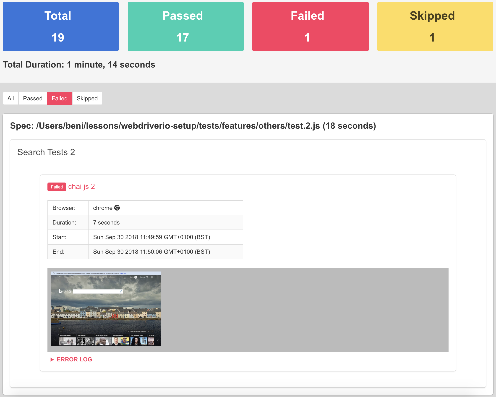
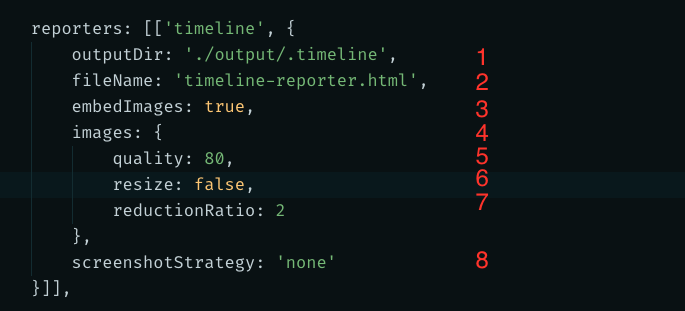

Wdio Timeline Reporter 
======================
[]()[]()[]()

> A one stop shop WebdriverIO reporter for an aggregated visualisation of your test results because "Seeing is believing"



## Why use it? 
Because we spend a lot of time debugging failing tests switching from terminal output to viewing error screenshots etc. This reporter aggregates all the typical information you will need into one report. Run tests and have a nice timeline of events you can look back at to further verify everything looks ok. Quite a few other use cases out there...

#### Features include:
1. Works great with Mocha and Jasmine frameworks. Also works with Cucumber but every step will be reported as a test
2. Loud Summary of the Test Results.
3. Detail of each test run including all screenshots captured during test execution.
4. Test Results filtering. Great for focusing on failed tests
5. Error stack trace attached to test.
6. Ability to add additional information to test at runtime.
7. No post processing required. On completion of wdio test process, a static html report file will get generated.
8. Timeline service to manage the taking of screenshots including resizing of the images.
  
   
An example html report can be found [here](http://htmlpreview.github.io/?https://github.com/QualityOps/wdio-timeline-reporter/blob/master/images/example-timeline-report.html)  

Instructions on how to install `WebdriverIO` can be found [here](http://webdriver.io/guide/getstarted/install.html).

## Installation

For version compatible with webdriverio v4 see [here](https://github.com/QualityOps/wdio-timeline-reporter/tree/V4)

```shell
npm install --save wdio-timeline-reporter
```

A dependency will be added to your `package.json`

```json
{
  "dependencies": {
    "wdio-timeline-reporter": "^5.0.0"
  }
}
```

### Usage

 Add ```timeline``` to the reporters array in your wdio config file.

 Also import and add ```TimelineService``` from wdio-timeline-reporter. 
 
 Service is mandatory to combine reports and create html as reporters are now initialised per runner instance in webdriverio 5 (discussion on webdriverio)[https://github.com/webdriverio/webdriverio/issues/3780]

```js
// wdio.conf.js
const { TimelineService } = require('wdio-timeline-reporter/timeline-service');
exports.config = {
  // ...
  reporters: [['timeline']],
  // ...
  services: [TimelineService],
};
```

### Reporter Options

If you wish to override the default reporter configuration add a reporterOptions object literal to timeline array under reporters as shown below.



| index | description                                                                                                                                                                                                                |
| ----- | -------------------------------------------------------------------------------------------------------------------------------------------------------------------------------------------------------------------------- |
| 1.    | Directory where html file and screenshots will be created in. Default value is ```./.timeline```                                                                                                                           |
| 2.    | Name of report html file. Default value is ```timeline-report.html```                                                                                                                                                      |
| 3.    | Embed images as base64 in html file. Default value is ```false```                                                                                                                                                          |
| 4.    | Object options for image manipulation                                                                                                                                                                                      |
| 5.    | Set JPEG quality. Only relevant if ```resize``` option is ```true```. The smaller the value, the smaller image size and quality would be. Default value is ```70```. Max value allowed is ```100```                        |
| 6.    | Resize image. Default value is ```false```                                                                                                                                                                                 |
| 7.    | value to decrease the total number of pixels by. Only relevant if ```resize``` option is true. Defaults to ```1``` Valid values ```1 - 5```                                                                                |
| 8.    | how often to take screenshots. Supported values are ```on:error```, ```before:click```, ```none```. Defaults to ```none```. ```before:click``` is a great option for creating a timeline of screenshots of app under test. |


### Add additional information to test context
It is possible to add additional information to a test using the `addContext` static method. This can be useful for adding important information that could help in debugging failed tests for example a user created during the test run with a dynamic username

#### Basic usage
The `TimelineReporter.addContext` static method accepts either a string parameter or an object literal with two properties `title` and `value` e.g 
```js
{ title: 'sessionId', value: 'b59bb9ec-ab15-475e-9ce6-de8a14ca0cd3' }
```
value could be also be a link

##### Mocha example
```js
const TimelineReporter = require('wdio-timeline-reporter').default;

describe('Suite', function() {
    it('Test', function() {
        // object literal parameter
        TimelineReporter.addContext({
          title: 'Test User',
          value: 'user id created during the test'
        });

        // value as anchor tag
        TimelineReporter.addContext({
          title: 'Dynamic link',
          value: '<a href="">Some important link related to test</a>'
        });

        // string parameter
        TimelineReporter.addContext('This test might be flaky');
    });
});
```